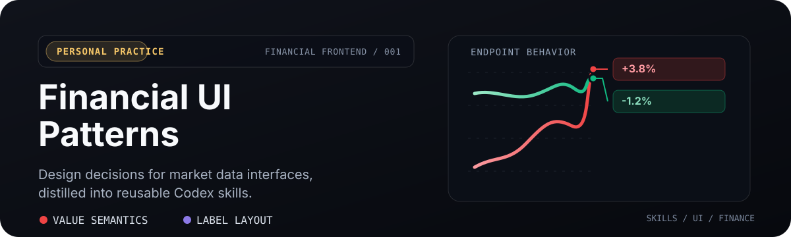
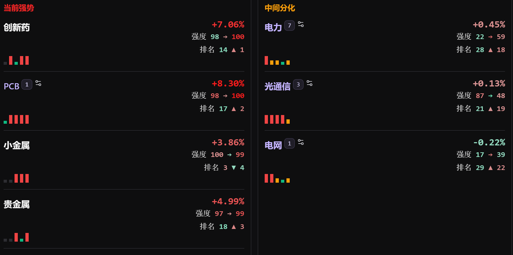
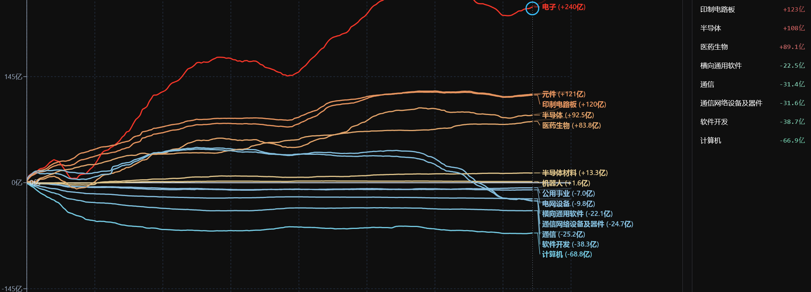

# Financial UI Patterns

  <a href="./README.md">English</a> · 简体中文

  

  从我个人金融产品前端实践中提炼出的设计模式与 Codex skills。

  <a href="#已收录技能">技能</a> · <a href="#安装到-codex">安装</a> · <a href="#原则">原则</a>

  

## 这里收录什么

这是一个小而持续增长的金融界面设计经验集：数值应如何表达方向与强弱，以及信息密集的图表应如何保持线尾标签可读，同时不篡改底层市场事实。

它不是产品代码仓库、行情数据源、交易系统，也不构成投资建议。

## 已收录技能

### [`stock-colors`](./skills/stock-colors)

**让金融数值一眼可读。** 定义中国市场常用的红涨绿跌与绝对值渐变语义，适用于数值标签、表格、热力图与图表。小幅波动保持柔和，较大波动更鲜明，但不让小数值变得浑浊难辨。

  

### [`financial-chart-end-labels`](./skills/financial-chart-end-labels)

**让折线末端既真实又清晰。** 定义线尾标签避让、真实终点连接线、最小碰撞链、状态标记和历史回放行为。强者保持平行，只有将会重叠的后续标签才向下尾随。

  

## 设计边界

两个 skill 有意保持互补：

| 关注点 | Skill | 判断原则 |
| --- | --- | --- |
| 数值颜色表达什么 | [`stock-colors`](./skills/stock-colors) | 颜色只能强化带符号数值与单位，不能替代它们。 |
| 折线线尾标签应放在哪里 | [`financial-chart-end-labels`](./skills/financial-chart-end-labels) | 移动标签，不移动市场事实或曲线几何。 |

## 安装到 Codex

~~~bash
git clone https://github.com/7oMB2006/financial-ui-patterns.git
cp -R financial-ui-patterns/skills/stock-colors ~/.codex/skills/
cp -R financial-ui-patterns/skills/financial-chart-end-labels ~/.codex/skills/
~~~

Windows PowerShell 请以 `Copy-Item -Recurse` 替代 `cp -R`。安装后重新载入 Codex，使其识别新的 skill 目录。

## 原则

- 从真实金融产品的实现经验中提炼规则，再将其抽象为可迁移的方法。
- 不在可复用 skill 中保留产品名、私有数据、接口或项目专属约定。
- 把金融界面当作解释事实的表面：明确展示带符号数值、单位、时间戳、数据源状态与不可用状态。
- 优先采用维护市场事实的交互与视觉规则，而不是装饰性的视觉效果。

## 许可证

采用 [MIT License](./LICENSE) 发布。
